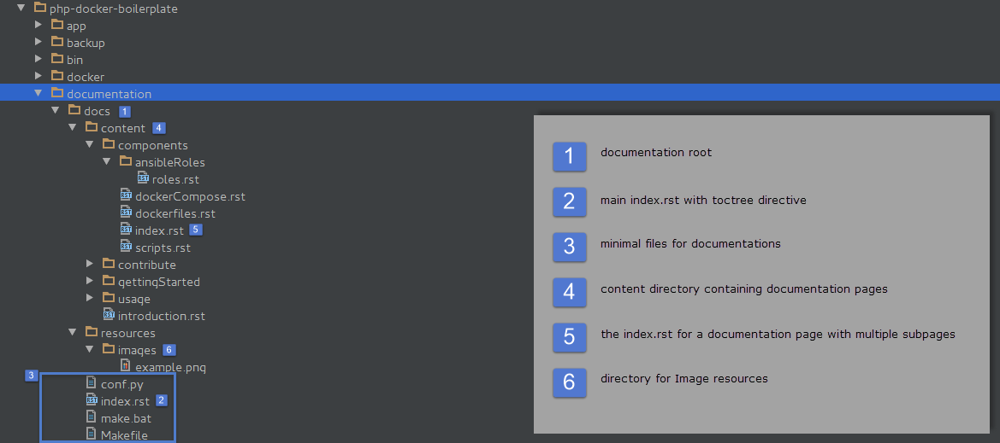
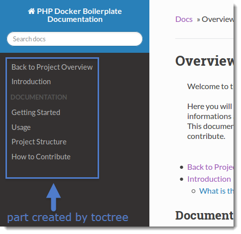

======================
Documentation Workflow
======================

This page is a short introduction to our documentation file structure and our documentation workflow.
This is mainly important for those who want to contribute to our Documentation.

------
Sphinx
------

| This documentation is rendered with `Sphinx <http://www.sphinx-doc.org>`_ and hosted by `Read The Docs <https://readthedocs.org/>`_.
| In order to edit parts of our documentation, you can simply edit the ReST files (.rst).
| However in order to Preview the changes, as they would be rendered in our final Documentation you need a Sphinx setup.
|
|

Setting up Sphinx
=================

To get a Sphinx setup up and running, you can either install it directly on your system or you simply use our docker container which comes ready to use for our docs.

Sphinx Docker Image
===================

| We have built a Sphinx Image for Docker, which already contains the required Setup for a quick start with Sphinx.
| The exact Setup can be found in our `Dockerfile Repository on GitHub. <https://github.com/webdevops/Dockerfile/tree/feature/sphinx/docker/sphinx/latest>`_
|
| The Image is built with alpine linux to have a verry small footprint.
| It simply installs python and the required libraries automatically and allows you to kickstart working with Sphinx.
|
| To use it you can run the following command, which will be explained below.

.. code-block:: bash

   docker run -t -i --rm -p 8080:8000 -v <pathToTheDocsDir>:/opt/docs webdevops/sphinx sphinx-autobuild -H 0.0.0.0 /opt/docs html

* To simply use it just change the **<pathToTheDocsDir>** with the path to the projects **docs** directory.
* For example you cloned the **php-docker-boilerplate* repository to ``/home/myuser/projects/php-docker-boilerplate``, the directory to the docs directory would be ``/home/myuser/projects/php-docker-boilerplate/documentation/docs``.
| When executing, you should see a Sphinx message like this at the end:

.. code-block:: bash

   [I 160328 16:39:17 server:281] Serving on http://0.0.0.0:8000
   [I 160328 16:39:17 handlers:59] Start watching changes
   [I 160328 16:39:17 handlers:61] Start detecting changes

| This indicates that your Sphinx preview Server is startet.
| Since this is inside docker you can access it in your browser with **http://127.0.0.1:8080** instead of the displayed url.
|
| Sphinx has opened up his own small Webserver to provide the rendered documentation and applies every change.
| To close it, simply hit Ctrl+C or if you forgot to shut down this docker container, you can also use **docker ps** and call **docker stop <nameOfTheContainer>**.
|
| This is all you need to run our container. However you can find a detailed explaination bellow.
|
|

Detailed Explaination
---------------------

* This command calls **docker run** which simply will run a container.
* The parameters **-t** and **-i** are standard to run pseudo TTY and interactive mode.
* The parameter **--rm** will remove older containers if they exist.
* With **-p 8080:8000** we tell docker to expose the port 8000 inside the container to the local port 8080 (you can change that port if you like).
* The parameter **-v <pathToTheDocsDir>:/opt/docs** sets the mounting of our documentation directory inside the container. While *<pathToTheDocsDir>* is our documentation directory, we mount it to */opt/docs* inside the container.
* Now we tell docker, which image to take, in this case **webdevops/sphinx**. After that we add the command we want to execute inside the container.
|
| With **sphinx-autobuild -H 0.0.0.0 /opt/docs html** we tell sphinx to autobuild the content from ``/opt/docs`` to a folder ``html``.
| The content of ``html`` is then rendered to a webserver that listens to the host (the **-H** option) **0.0.0.0** which allows us to call it with whatever domain from the host system.
|
|

Sphinx Manual Setup
===================

| To get this setup working, you have to get a running Sphinx environment running.
|
| This requires Python, which is propably installed (you can check it with ``python --version``).
| Make sure you have python in version around 2.7 (which is what we use).
|
| Next you will require the Python package manager **pip**.
| In most of the cases you will find something like ``python-pip`` in the Package manager of your operating system.
| However you can also consult the `pip documentation <https://pip.pypa.io/en/stable/installing/>` pages.
|
| If those requirements are met, you can simply install the following pip packages:

.. code-block:: bash

   pip install sphinx sphinx-autobuild recommonmark

| You now can use the ``sphinx-autobuild`` feature to generate the html code.
| Make sure to generate the resulting html outside the project, since we dont want this in the GitHub Repository.
| Here is an example on how to use ``sphinx-autobuild``:

.. code-block:: bash

   # example assuming you cloned the project php-docker-boilerplate to /home/myuser/projects/php-docker-boilerplate
   cd /home/myuser/projects/php-docker-boilerplate/documentation/docs
   sphinx-autobuild . ~/projects/php-docker-boilerplate-docs

| You should now be able to access the Sphinx project locally by opening the index.html in ~/projects/php-docker-boilerplate-docs or the local server generated by sphinx-autobuild at **http://127.0.0.1:8000**.
|
|

-----------------------
Documentation Structure
-----------------------

To prevent chaos within our documents and to ensure Read the Docs is able to render our documents as expexted, we sustain some standards across our documentation files.

File Structure
==============

Our file structure consists of the following rules:

* Our documentation files for Read the Docs always reside in the project directory under the subdirectory ``documentation/docs``.
* Each ``docs`` directory has to contain at least the following files: **conf.py, index.rst, make.bat, Makefile**
* The file **index.rst** inside the documentation root must contain one or multiple ``toctree`` directives that contain a backlink to this documentation and a link to every menu documentation page, listed in the main menu.
* Every documentation file must be inside a subdirectory ``docs/content``.
* In case a documentation page consists of multiple pages, another subdirectory is added with the name of that section. Each section has one entry point, named **index.rst** which also contains a ``toctree`` directive referencing ech subpage.
* Any resources are contained in a subdirectory ``docs/resources``. Each type of resource is placed inside another directory like ``docs/resources/images``.

| These rules may seem complicated, but realy arent.
| The following screenshot displays the structure with PHP Docker Boilerplate as example project:
|

|
|

index.rst Files
===============

| In our project documentations each file referencing other files, is called **index.rst**.
| Each **index.rst** can contain some content, but it must contain a toctree declaration, referencing other documentation files.
|
| We distinguish between the **root index.rst** and **content index.rst** files.
|

Root index.rst
--------------

| The root **index.rst** resembles the **landing page** of the documentation.
| It also contains the main toctree directive, which is used to build the left side navigation.
| We have to make sure, that every other page is reachable by this root toctree.
| It is also worth mentioning that only pages listed here will be displayed when nothing else is selected.
|
| The toctree directive can look like the following from php-docker-boilerplate:

.. code-block:: rest

   .. toctree::

      Back to Project Overview <http://webdevops-documentation.readthedocs.org/en/latest/>
      content/introduction

   .. toctree::
      :caption: Documentation

      content/gettingStarted/index
      content/usage/index
      content/components/index
      content/contribute/index

| Notice that every part, after declaring the ``toctree`` directive has an intendation.
| There also must be one empty line between the ``toctree`` definition and the listed items.
| The ``:caption:`` declaration, allows us to define a headline for a set of toctree items.
|
| As you can see we can define multiple ``toctree`` directives.
| We also want to contain a link **Back to Project Overview** to our main documentation.
| Every documentation page references either a file directly or an index file in its responsible directoy.
|
| Here is an image of what this ``toctree`` produces:
|

|

Content index.rst
-----------------

| The **index.rst** file for content pages are similar to the rules for the **Root index.rst**.
| This file represents the landing page of your topic, from here you may want to reference to different aspects of this topic.
| To do this, you can also enter an ``toctree`` for for this subpage to reference them.
|
| Here is an example from PHP Docker Boilerplate in the subpage **Contribute**:

.. code-block:: rest

   .. toctree::
      :maxdepth: 1

      code
      documentation

| Notice that this time, we generally avoid captions.
| Generally speaking, it makes sense to define the ``:maxdepth:`` directive in subpages.
| The referenced files are always relative to the file, calling the ``toctree``.
|

Toctree Directive for Structure
-------------------------------

| While generaly it makes sense to define some level of abstraction with ``toctree``, it should not be the tool of choice when it comes to defining a hierarchical structure.
| You should only use lower level ``toctree`` to split bigger parts of the documentation into smaller chunks.
| Every documentation page, loaded in another file, will trigger a page reload.
| In the following section, we describe the headlines as tool of choice when it comes to structure the documentation itself.
|
|

Headlines and Hierarchy
=======================

| The way Sphinx works, it is very important to choose headlines to structure the Documentation.
| Different headlines will be rendered as hierarchical structure into the menu.
| This specific documentation page, for example consists of only one file and the menu to the left is generated by carefully choosing headlines.
|
| Headlines are defined by over and/or underlining the specific title.
| Here a valid headline with the highest hierarchy:

.. code-block:: rest

   ===========
   My Headline
   ===========

| This example has over and underline and their length must match the title.
| Headlines must be defined verry specific, here is a list with their definition by hierarchy highest to lowest.
| (`from sphinx documentation <http://www.sphinx-doc.org/en/stable/rest.html#sections>`_):
|

* `# with overline, for parts`
* `* with overline, for chapters`
* `=, for sections`
* `-, for subsections`
* `^, for subsubsections`
* `", for paragraphs`

| For the menu, the hierarchy is valid vor each document seperately.
| This means, every document can (and most of the time shoul) start with the highest hierarchy of headlines.
|
|

